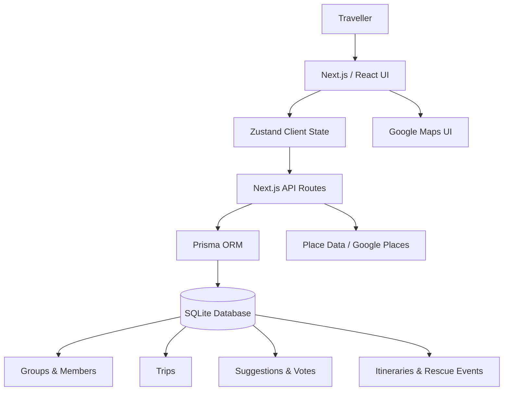

# TravPlanner by [Team Name]

**Team:** [Member 1], [Member 2], [Member 3], [Member 4]  
**Problem Statement:** Planning an Escape — Travel Planner  
**Video Presentation:** [Unlisted YouTube Link]  
**Presentation Slides:** [Public Slides Link]  
**Live Prototype:** [Deployed Prototype Link]

---

# 1. Project Overview

## The Problem

Planning a trip is rarely handled in one place.

Travellers may use separate tools for:

- finding places,
- discussing options in group chats,
- building an itinerary,
- checking routes,
- tracking a budget,
- splitting expenses,
- and reacting when plans change.

This becomes harder for group trips. Everyone may have different interests, budgets and priorities. Someone still needs to turn those opinions into one practical plan.

Existing travel planners such as **Wanderlog** already combine useful features such as itineraries, maps, route optimisation, budgeting and collaboration.

TravPlanner explores a different part of the problem:

> **How can a group move from individual preferences to a shared plan, while still being able to react when that plan stops working?**

Instead of treating the itinerary as the starting point, TravPlanner makes the **group decision process** part of the planning flow.

## Our Solution

**TravPlanner** is a collaborative travel-planning prototype for solo travellers and small groups.

Users progress through a guided planning flow: define the trip, express preferences, suggest places, vote together, create a shortlist, review practical constraints, organise the route and view the final itinerary.

The prototype also introduces **Trip Rescue**, which demonstrates how an existing itinerary could adapt when an activity becomes unavailable or unsuitable during the trip.

### Current Prototype Features

- Create and manage travel groups
- Create trips with dates, destination and budget
- Group member preference profiles
- Collaborative place suggestions
- Place discovery and map integration
- Group voting
- Shared shortlist
- Validation-oriented planning stage
- Route and map visualisation
- Day-by-day itinerary
- Trip budget overview
- Booking/price pressure indicators
- Split-bill calculator
- **Trip Rescue** for demonstrating unexpected-plan adjustment
- Shared final trip plan
- Persistent prototype data through Prisma and SQLite

### Core User Flow

```text
Create Group
     ↓
Create Trip
     ↓
Set Preferences
     ↓
Suggest Places
     ↓
Group Voting
     ↓
Build Shortlist
     ↓
Validate Choices
     ↓
Plan Route
     ↓
Build Itinerary
     ↓
Final Trip Plan
     ↓
Trip Rescue when plans change
```

---

# 2. Ideation & Process

## 2.1 Ideas We Considered

Our initial design was significantly larger than the final prototype.

During planning, we explored a production-oriented architecture involving authentication, detailed workflow state machines, deterministic validation, automated itinerary generation, approval systems, itinerary versioning, external travel APIs and AI explanations.

As development progressed, we narrowed the scope to prioritise a complete and demonstrable user experience.

| Idea | Decision | Reason |
|---|---|---|
| Collaborative place suggestions | **Kept** | Directly addresses fragmented group planning. |
| Member travel preferences | **Kept** | Gives the group a structured way to express different interests. |
| Group voting | **Kept** | Converts discussion into an explicit group decision. |
| Shared shortlist | **Kept** | Reduces many suggestions into a manageable planning set. |
| Route-oriented planning | **Kept** | Helps turn selected places into a practical trip. |
| Day-by-day itinerary | **Kept** | Required for the end-to-end planning experience. |
| Budget overview | **Kept** | Budget is a core requirement of the challenge. |
| Trip Rescue | **Kept** | Demonstrates how TravPlanner reacts when an existing plan changes. |
| Split Bill | **Added as prototype extra** | Useful during group travel and could reuse the trip's member structure. |
| Full deterministic constraint validator | **Simplified** | Production-level opening-hour, routing, budget and scheduling validation was too large for the available prototype time. |
| Up to three automatically optimised itinerary variants | **Deferred** | Required a much larger planning engine and validation layer. |
| Firebase Auth + Firestore + Cloud Functions architecture | **Replaced for prototype** | We prioritised a simpler Next.js + Prisma architecture that the team could complete and demonstrate reliably. |
| Complex OWNER/MEMBER approval workflow | **Deferred** | Valuable for production collaboration, but too complex for the prototype scope. |
| Immutable itinerary version history | **Deferred** | Not required to demonstrate the core planning concept. |
| Full post-finalisation Change Requests | **Deferred** | Trip Rescue communicates the more important adjustment concept with less complexity. |
| AI-generated itinerary | **Deferred** | We wanted the planning logic to remain understandable rather than depend on AI-generated schedules. |
| AI explanation layer | **Deferred** | Useful as a future enhancement after the core planning flow is stable. |
| Flight and hotel booking integrations | **Deferred** | They increase API and operational complexity without being necessary to demonstrate the central concept. |
| Automatic weather/disruption monitoring | **Deferred** | The prototype demonstrates the response flow rather than production event detection. |

### Major Pivot

The largest change was:

```text
Original direction
Production-oriented collaborative planning platform
with detailed backend authority and optimisation
                    ↓
Final prototype direction
Complete, understandable and demonstrable
group travel-planning experience
```

The original design remains useful as a long-term architecture reference. However, the implemented prototype intentionally focuses on the parts that communicate the product idea most clearly.

---

## 2.2 Ideation Boards

### Problem and Solution Map

> **TODO before submission:** Export the problem/solution diagram into the repository.

```markdown

```

This diagram should show how fragmented planning, group disagreement, budget concerns and unexpected changes connect to TravPlanner's main features.

### User Flow

> **TODO before submission:** Add one visual user-flow diagram.

```markdown

```

Recommended flow:

```text
Trip setup
   ↓
Group preferences
   ↓
Place suggestions
   ↓
Voting
   ↓
Shortlist
   ↓
Validation
   ↓
Route
   ↓
Itinerary
   ↓
Trip Rescue
```

The purpose of this diagram is to show that TravPlanner was designed as a **planning process**, rather than a collection of unrelated travel tools.

---

## 2.3 Mentor Consultation

> **Do not invent this section. Replace the placeholders with your team's actual mentor conversations.**

| Date | Mentor | Feedback Received | What Was Changed |
|---|---|---|---|
| [Date] | [Mentor] | [Specific feedback] | [What the team changed or why it was not adopted] |
| [Date] | [Mentor] | [Specific feedback] | [Result] |

---

# 3. Design & Prototype

**UI Prototype / Live Application:** [Public Link]

TravPlanner uses a guided stage-based interface so users always know what part of the planning process they are currently completing.

The implemented prototype follows these main stages:

1. Ideas
2. Preferences
3. Voting
4. Validation
5. Route
6. Itinerary

## Key Screens

> Replace the paths below with actual screenshots before submission.

### 1. Group and Trip Dashboard

```markdown

```

Users organise trips around a travel group and can see the trips associated with that group.

### 2. Trip Planning Progress

```markdown

```

The trip overview shows the current planning stage, dates, budget, group participation and planning progress.

### 3. Preferences and Place Suggestions

```markdown

```

Members express their travel preferences and contribute places they would like the group to consider.

### 4. Group Voting

```markdown

```

Suggested places become shared decisions through the voting stage.

### 5. Shortlist and Validation

```markdown

```

The group narrows the available choices and reviews practical information before building the trip.

### 6. Route and Map

```markdown

```

Selected activities can be viewed spatially to make the trip easier to understand and reduce unnecessary backtracking.

### 7. Final Plan and Budget

```markdown

```

The final trip workspace combines the itinerary, map, budget, booking indicators and selected places.

### 8. Trip Rescue

```markdown

```

Trip Rescue demonstrates an unexpected event affecting the itinerary, evaluates a prepared alternative and lets the traveller accept the replacement.

---

# 4. What Makes It Different

TravPlanner's main idea is not simply to generate an itinerary.

It focuses on the **transition from individual group preferences to a shared, usable plan**.

## 1. Planning as a Visible Process

Instead of immediately producing an opaque generated itinerary, TravPlanner exposes the major decisions:

**Preferences → Suggestions → Voting → Shortlist → Validation → Route → Itinerary**

Users can understand how the final trip developed.

## 2. Group Decisions Become Planning Inputs

Members do not only edit a shared document.

They contribute preferences and places, then vote before the trip is finalised.

This makes group agreement part of the product workflow.

## 3. Trip Rescue

Planning does not end once an itinerary is created.

Trip Rescue demonstrates how TravPlanner could respond when an activity no longer works by:

1. identifying the affected activity,
2. evaluating the impact,
3. presenting an alternative,
4. showing its travel, availability and cost implications,
5. and updating the shared itinerary after acceptance.

The current implementation is a **prototype demonstration of this workflow**, rather than a production real-time disruption-monitoring service.

## 4. One Continuous Workspace

TravPlanner brings together:

- group preferences,
- suggested activities,
- voting,
- maps,
- itinerary,
- budget,
- booking awareness,
- expense splitting,
- and plan adjustment.

The goal is to reduce the number of separate decisions and tools travellers need to coordinate manually.

---

# 5. Technical Architecture & Feasibility

## Current Prototype Stack

| Layer | Technology | Why We Use It |
|---|---|---|
| Frontend | Next.js 16 + React 19 | Provides the application UI and routing in one project. |
| Language | TypeScript | Gives consistent types across frontend and server code. |
| Styling | Tailwind CSS 4 | Allows fast development of a consistent responsive UI. |
| Client State | Zustand | Keeps shared prototype state simple and lightweight. |
| Backend | Next.js Route Handlers | Allows frontend and prototype APIs to remain in one codebase. |
| ORM | Prisma | Provides structured database access and a clear domain schema. |
| Database | SQLite | Simple persistence suitable for the current prototype and seeded demo environment. |
| Maps / Places | Google Maps / Places integration | Supports place discovery and geographical presentation. |
| Icons | Lucide React | Provides a consistent interface icon set. |

## Current Architecture



The browser does not rely only on hard-coded frontend state. Prototype mutations are sent through server API routes and persisted through Prisma.

## Simplification From Original Architecture

Our original technical design proposed:

```text
React/Vite
   ↓
Firebase Authentication
   ↓
Cloud Functions
   ↓
Firestore
   ↓
Validator + Planner
   ↓
Google Places / Routes
   ↓
Optional AI explanation layer
```

This architecture remains a possible production direction, but implementing its complete security, concurrency, validation and planning rules would have reduced our ability to finish the prototype.

The competition prototype therefore uses a smaller architecture:

```text
Next.js
   ↓
Next.js API routes
   ↓
Prisma
   ↓
SQLite
```

This trade-off lets us demonstrate the complete product concept while keeping the codebase understandable and achievable within the hackathon period.

---

## Prototype vs Production Scope

We intentionally distinguish between what the current prototype demonstrates and what a production system would require.

| Area | Prototype | Production Direction |
|---|---|---|
| Group planning | Implemented | Real-time multi-user synchronisation |
| Preferences | Implemented | Richer recommendation profile |
| Place suggestions | Implemented | Larger external place-data integration |
| Voting | Implemented | Stronger decision rules and concurrency handling |
| Shortlist | Implemented | Automated deterministic ranking |
| Validation | Demonstrated | Full constraint-validation engine |
| Route planning | Demonstrated | Live route/time optimisation |
| Itinerary | Implemented | Automated constraint-aware planner |
| Budget | Implemented at prototype level | Full cost/booking integration |
| Trip Rescue | Interactive prototype | Live disruption/weather detection and revalidation |
| Split Bill | Prototype feature | Persistent expense ledger and settlement |
| Authentication | Not production-ready | OAuth/authentication and access control |
| Database | SQLite prototype | Managed production database |
| Multi-user security | Limited | Full server-side authorisation |
| AI | Deferred | Explanation and trade-off assistance only |

---

## Build Plan & Scope

### Prototype Completion Scope

Before submission we are prioritising:

1. Stable end-to-end group planning flow.
2. Simple solo-travel demonstration.
3. Reliable seeded demonstration data.
4. Working core buttons and navigation.
5. Public deployment.
6. Key prototype screenshots.
7. Ideation documentation.
8. Final presentation video.

### Explicit Non-Goals for This Prototype

We are **not** attempting to finish:

- production authentication,
- production multi-user concurrency,
- full Firebase migration,
- a complete constraint optimisation engine,
- automatic live weather monitoring,
- automatic disruption detection,
- flight booking,
- hotel booking,
- payment processing,
- production expense settlement,
- or a production-scale database.

This narrower scope is intentional. The goal is to demonstrate the central product idea reliably before investing in production infrastructure.

---

# 6. Competition Requirement Coverage

| Requirement | TravPlanner Prototype |
|---|---|
| End-to-end trip planning | Guided trip flow from setup and preferences through itinerary |
| Budgeting | Trip budget views, price awareness and Split Bill prototype |
| Itinerary building | Day-by-day itinerary and final-plan screens |
| Group preference synchronisation | Member preferences, place suggestions and group voting |
| Adjustment to unexpected changes | Trip Rescue prototype |
| Faster planning | Major planning decisions are combined into one guided workflow |
| Less stressful planning | Visible stages reduce the need to manually coordinate information across separate tools |
| Solo travel | Shared planning model can operate with a single traveller; dedicated solo UX remains limited |
| Group travel | Primary prototype flow |
| Deployable demonstration | [Deployment Link] |

---

# 7. Impact

## Target Users

TravPlanner primarily targets:

- small groups of friends,
- university students travelling together,
- young travellers organising trips collaboratively,
- and solo travellers who still want a structured planning flow.

We intentionally avoid defining the target audience as simply “everyone who travels”.

## Before TravPlanner

A group may need to:

```text
Group chat
   +
Maps
   +
Saved places
   +
Voting/polls
   +
Spreadsheet
   +
Itinerary tool
   +
Budget calculator
```

Members repeatedly copy information between tools and manually reconcile different preferences.

## With TravPlanner

```text
Preferences
     ↓
Suggestions
     ↓
Voting
     ↓
Shortlist
     ↓
Route
     ↓
Itinerary
     ↓
Trip Rescue

        TravPlanner
```

The desired impact is not only fewer applications.

It is **less coordination work between people**.

---

# 8. Future Development

If TravPlanner were continued beyond the prototype, the next priorities would be:

1. Production authentication and authorisation.
2. Managed production database.
3. Real-time collaborative synchronisation.
4. Deterministic itinerary feasibility validation.
5. Automatic route optimisation.
6. Stronger budget constraints.
7. Itinerary alternatives and comparison.
8. Itinerary history/versioning.
9. Real external disruption and weather signals.
10. Safer automatic Trip Rescue.
11. Explanation-only AI for trade-offs and planning decisions.
12. Optional flight, hotel and activity-provider integrations.

The original design documentation explores several of these areas in substantially more detail.

---

# 9. Running the Prototype Locally

## Requirements

- Node.js
- npm

## Setup

```bash
git clone https://github.com/qianyi-11/TravPlanner.git
cd TravPlanner
git checkout version1
npm install
```

Generate the Prisma client:

```bash
npm run db:generate
```

Prepare the database:

```bash
npm run db:push
npm run db:seed
```

Start the application:

```bash
npm run dev
```

Open:

```text
http://localhost:3000
```

---

# 10. Repository Structure

```text
TravPlanner/
├── app/
│   ├── api/                 # Prototype backend API routes
│   ├── groups/              # Group planning screens
│   ├── trips/               # Main trip workflow
│   └── split-bill/          # Expense-splitting prototype
│
├── components/
│   ├── trip/                # Trip-specific UI components
│   └── ui/                  # Shared interface components
│
├── lib/
│   ├── server/              # Prisma/server utilities
│   ├── store.ts             # Zustand state and API actions
│   ├── types.ts             # Application domain types
│   └── google-*.ts          # Google integration utilities
│
├── prisma/
│   ├── schema.prisma        # Prototype database schema
│   └── seed.ts              # Deterministic demo data
│
└── public/
```

---

# 11. Design Reference

The project began with a larger architecture and MVP specification covering deterministic planning, validation, voting, approvals, backup handling, versioning, security and external APIs.

**Original Design Planning:**  
[CodeNection 2026 — Google Docs](https://docs.google.com/document/d/1fiUs3ogM99BjK-oBim_cT2xnQYW83PK6e-k9U4fCZr4/edit)

The current repository implementation is treated as the source of truth for what is demonstrated in the submitted prototype.

---

# 12. Submission Links

- **GitHub:** https://github.com/qianyi-11/TravPlanner
- **Live Prototype:** [Link]
- **Video Presentation:** [Unlisted YouTube Link]
- **Presentation Slides:** [Public Link]
- **UI / Design:** [Public Link]