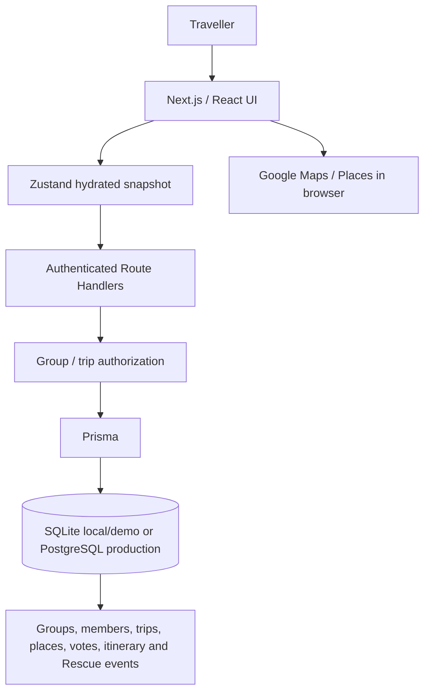

# Trippy — Plan your trip together

**Team:** TODO

**Team Members:** TODO

**Problem Statement:** Planning an Escape — Travel Planner

**Video Presentation:** TODO — unlisted YouTube link required

**Presentation Slides:** TODO — public link required

**UI Prototype:** TODO — public link required

**Repository:** https://github.com/qianyi-11/TravPlanner

---

# 1. Project Overview

## The Problem

Travel planning is fragmented across place discovery, group chats, polls, maps, itineraries, budgets and expense tools. Group travel adds the harder coordination problem: different travellers bring different interests, budgets, priorities and must-dos, but the group still needs one plan.

The challenge spans budgeting, itinerary building, group preferences, traveller coordination, unexpected plan changes, and both solo and group travel. Existing solutions such as Wanderlog show how useful it is to combine itineraries, maps, budgeting and collaboration. Trippy targets a narrower gap: **converting different individual preferences into one shared plan whose trade-offs remain visible**.

## Our Solution

Trippy is a collaborative travel planner for solo travellers and small groups. Its main differentiator is explainable **Group Consensus**, which turns member preferences, suggestions and votes into a shared shortlist. The confirmed shortlist then feeds validation, a sequence preview and a persisted itinerary. **Trip Rescue** demonstrates how that itinerary can be adjusted after a prepared plan change.

### Current Prototype Features

- Group and trip setup
- Member preference profiles
- Collaborative place suggestions and trip-scoped voting
- Google Places discovery with saved provider snapshots
- Server-authoritative deterministic Group Consensus with explainable trade-offs
- Persisted consensus shortlist
- Validation and deterministic itinerary building from a confirmed shortlist
- Sequence preview and map visualisation without route optimisation
- Day-by-day itinerary and final plan
- Known estimated itinerary spend with incomplete costs kept in scope as unknown
- Calendar-based planning urgency computed from days until departure, not price or demand prediction
- Shared persisted trip Split Bill with revision protection
- Shared trip checklist with member assignment and completion tracking
- Trip Rescue using prepared prototype events, alternatives and saved Plan B backups
- Auth.js with Google OAuth, stable Member provisioning and server-side group/trip authorization
- Prisma persistence with SQLite for local/demo use and PostgreSQL for production

### Latest Competition-Readiness Status

The `version1.1` branch has been verified locally after the Trippy messaging refinement:

- The landing page communicates the flow from different preferences through suggestions, voting and explainable Group Consensus to a shared itinerary.
- Consensus results show the existing base score, fair score and representation adjustment without changing the deterministic algorithm.
- The core pages passed a one-off 390 × 844 smoke check with no horizontal overflow.
- `npm run test:domain`: 45/45 passed; `npm run test:integration`: 38/38 passed.
- Type generation, TypeScript, full lint and production build passed. The build still reports two generated Prisma tracing warnings.
- `npm run demo` and `npm run demo:record` passed the full seeded flow, including Plan B, checklist, Split Bill, Trip Rescue and reload persistence.
- The demo uses isolated `prisma/demo.db`; recording output is written locally to `demo-output/travplanner-demo.webm`.

### Core User Flow

```text
Create Group
     ↓
Create Trip
     ↓
Set Preferences
     ↓
Suggest Places
     ↓
Vote
     ↓
Group Consensus
     ↓
Confirm Shortlist
     ↓
Validate
     ↓
Sequence Preview
     ↓
Build Itinerary
     ↓
Final Plan
     ↓
Trip Rescue
```

---

# 2. Ideation & Process

## 2.1 Ideas We Considered

### Solution Directions Considered

| Idea | Decision | Reason |
|---|---|---|
| Collaborative group planner | **Kept** | Directly addresses fragmented planning and group coordination. |
| Group voting | **Refined** | Voting captures opinions, but alone was not distinctive enough; it now feeds explainable Group Consensus. |
| Explainable Group Consensus | **Implemented** | Turns preferences and votes into a server-authoritative, deterministic and fairness-aware shared shortlist. |
| Group Availability Poll | **Deferred** | Useful for finding overlapping free time, but the team prioritised the core planning flow and competition demo. |
| Meeting Point Recommendation | **Deferred** | Useful when members start in different places, but it requires additional location and travel-time logic outside the current MVP. |
| Flight-ticket integration | **Deferred** | It could broaden the platform but does not strengthen the core MVP enough to justify implementation before submission. |
| URL-to-travel-data extraction | **Deferred** | It could simplify data entry but does not strengthen the core MVP enough to justify implementation before submission. |
| Plan B per Stop | **Implemented** | Travellers can save one backup place for an itinerary stop before disruption occurs. |
| Shared Checklist | **Implemented** | Gives trip members one persisted preparation list with assignment and completion tracking. |
| AI-generated itinerary approach | **Deferred** | Deterministic behaviour is easier to explain and demonstrate reliably. |
| Trip Rescue | **Implemented in simplified form** | A saved Plan B or prepared fallback demonstrates adjustment without claiming live detection. |
| Budget and Split Bill support | **Simplified** | The prototype shows known estimated spend and a shared Split Bill without claiming a settlement-grade ledger. |
| Large production-oriented planning platform | **Replaced** | The scope was too broad for a complete prototype journey. |

### Technical and Scope Decisions

| Decision | Status | Reason |
|---|---|---|
| Firebase-oriented architecture | **Replaced** by Next.js + Prisma | A single application and SQLite-backed persistence were achievable for the prototype. |
| Complex approval workflow | **Deferred** | It was not required to demonstrate group decision-making. |
| Itinerary history and versioning | **Deferred** | A single persisted itinerary is enough for the current journey. |
| Flight and hotel integrations | **Deferred** | Provider and operational complexity would distract from the core concept. |
| AI explanation layer | **Deferred** | Rule-based explanations already expose the current trade-offs. |
| Live disruption monitoring | **Deferred** | Trip Rescue demonstrates response, not automatic detection. |

## 2.2 Ideation Boards

### Problem and Solution Map

The planned map should show how fragmented tools, group disagreement, budget uncertainty and plan changes connect to the product. It influenced the decision to keep one guided workflow centred on Group Consensus rather than a collection of disconnected utilities.

**Consolidated ideation map based on documented team decisions and mentor feedback:**

```text
Fragmented travel tools + different traveller preferences
                         ↓
              Group disagreement + plan changes
                         ↓
                 Coordination overhead
                         ↓
Structured preferences → Voting → Explainable Group Consensus
                         ↓
Shared itinerary → Plan B, Shared Checklist, Split Bill → Trip Rescue
```

### User Flow

```text
Trip setup → Preferences → Suggestions → Voting → Group Consensus
→ Shortlist → Validation → Sequence Preview → Itinerary → Trip Rescue
```

This flow demonstrates the coordination problem from opinions to an actionable plan. It influenced the stage-based interface and the decision to keep each planning transition visible.

**Consolidated user-flow map based on the implemented prototype:**

```text
Trip setup → Preferences → Suggestions → Voting → Group Consensus
→ Shortlist → Validation → Sequence Preview → Itinerary
→ Plan B + Checklist + Split Bill → Trip Rescue
```

## 2.3 Idea Evolution

| Stage | Direction | Why It Changed |
|---|---|---|
| Initial direction | Production-oriented collaborative travel platform | It covered too many workflows, integrations and infrastructure concerns for the prototype period. |
| Problem found | Scope was too broad | A partial platform would not prove the complete group-planning journey. |
| Refinement | Prioritise one end-to-end group-planning flow | This made the main user problem demonstrable from preferences through itinerary. |
| Key product decision | Deterministic, explainable consensus instead of opaque AI-generated planning | Reviewers and travellers can see why places are selected. |
| Technical simplification | Replace the Firebase-oriented architecture with Next.js, Prisma and SQLite | The smaller stack supports reliable local and seeded demonstration. |
| 09/09/2026 mentor feedback | Simple voting needed stronger differentiation; existing planners and wider coordination problems should be examined | The team focused the product on the group decision process, kept Trip Rescue secondary and evaluated other coordination ideas selectively. |
| Final prototype direction | Preferences → voting → explainable consensus → shared itinerary → coordinated preparation → Trip Rescue | Group agreement remains primary, while Plan B, Shared Checklist, Split Bill and prepared adjustment support the shared plan. |

## 2.4 Mentor Consultation

| Date | Mentor | Feedback | Team Decision / Change |
|---|---|---|---|
| 09/09/2026 | Mentor 1 | Groups with different schedules struggle to find a suitable meeting time; consider a calendar or availability input that identifies overlaps. | Considered a Group Availability Poll; deferred it from the current MVP to prioritise the core collaborative planning flow and competition demo. |
| 09/09/2026 | Mentor 1 | Members starting from different places need a practical meeting point; consider using distance or travel time to suggest a location such as a café. | Considered a Meeting Point Recommendation; deferred it because the extra location and travel-time logic is outside the current MVP. |
| 09/09/2026 | Mentor 1 | Study existing travel planners, particularly Wanderlog, and clarify why travellers would choose Trippy. | Strengthened conservative competitive analysis and positioned Trippy around the group decision process between individual preferences and one shared itinerary. |
| 09/09/2026 | Mentor 1 | Voting was a promising direction, but the team needed to examine the problem more deeply and establish a clearer unique selling point. | The feedback pushed us to strengthen simple voting into a more differentiated **Preferences → Voting → Explainable Group Consensus → Shared Plan** workflow. |
| 09/09/2026 | Mentor 1 | Survey the market, compare competitors and explain what makes Trippy stand out. | Added a comparison focused on Trippy’s own product emphasis without claiming unverified gaps in competing products. |
| 09/09/2026 | Mentor 1 | Explore broader ideas including flight-ticket functionality and automatic travel-data extraction from a URL. | Recorded both as deferred ideas; neither directly strengthens the core MVP enough to justify implementation before submission. |
| 09/09/2026 | Jarod Tan | Research previous hackathon travel and group-planning projects to understand common patterns. | **Decision:** research previous hackathon projects before finalising differentiation; no completed findings are claimed here. |
| 09/09/2026 | Jarod Tan | Group voting alone was not sufficiently distinctive because similar voting and preference mechanisms are common. | Repositioned basic voting as an input to the stronger Explainable Group Consensus workflow rather than the innovation itself. |
| 09/09/2026 | Jarod Tan | Look for a more memorable or ambitious product direction. | Based on this feedback, the team reviewed how to make the product more distinctive, retaining Group Consensus as primary and strengthening the supporting story around Trip Rescue, Plan B, Shared Checklist and Split Bill. |

Before mentorship, Trippy was primarily framed as a travel planner with collaborative voting. After the sessions, the team focused more strongly on the difficult group-coordination problem: **different preferences → voting → explainable consensus → shared itinerary → coordinated preparation → adjustment when plans change**. The mentors did not design the implemented features or scoring algorithm; their feedback prompted the team to sharpen the product’s differentiation and document why ideas were implemented or deferred.

---

# 3. Design & Prototype

**UI Prototype:** TODO — use the public link from the submission header.

Screenshots have not been added to the repository and still need to be captured before submission.

## Key Screens

### 1. Group and Trip Dashboard

**Does:** Organises trips around their travel groups. **Interaction:** Create or open a group and trip. **Matters:** Establishes who is planning together and gives the journey one shared starting point.

### 2. Trip Planning Progress

**Does:** Shows dates, budget, participation and the current planning stage. **Interaction:** Continue to the next available stage. **Matters:** Makes the planning process and remaining work visible.

### 3. Preferences and Suggestions

**Does:** Captures interests, food preferences, pace, must-dos, dislikes and candidate places. **Interaction:** Submit preferences and suggest places. **Matters:** Turns individual opinions into structured planning inputs.

### 4. Group Voting and Consensus

**Does:** Displays trip-scoped votes and the explainable Group Consensus result together. **Interaction:** Vote, choose shortlist capacity and review selection reasons and fairness trade-offs. **Matters:** Makes Trippy’s server-authoritative primary differentiator visible at the decision point.

### 5. Shortlist and Validation

**Does:** Presents the confirmed candidates and saved place details for review. **Interaction:** Confirm the shortlist and inspect practical information. **Matters:** Creates a deliberate checkpoint before itinerary building.

### 6. Sequence Preview / Map

**Does:** Displays the saved stop order and geographic grouping. **Interaction:** Inspect stops and continue to itinerary building. **Matters:** Makes the proposed sequence understandable without claiming route optimisation.

### 7. Itinerary and Final Plan

**Does:** Combines the persisted day-by-day itinerary, map, known estimates and planning urgency. **Interaction:** Review daily activities and the final shared plan. **Matters:** Converts selected ideas into an actionable schedule while leaving unknown costs explicit.

### 8. Trip Rescue

**Does:** Shows a prepared event, evaluates a prepared alternative and updates the persisted itinerary after acceptance. **Interaction:** Compare and accept the replacement. **Matters:** Demonstrates how the plan can remain useful after circumstances change.

---

# 4. What Makes It Different

## Planning as a Visible Process

Trippy exposes the decisions that produce the itinerary:

**Preferences → Suggestions → Voting → Group Consensus → Shortlist → Validation → Sequence Preview → Itinerary**

The itinerary is an outcome of visible group decisions, not an unexplained starting point.

## Explainable Group Consensus

Group Consensus is the primary differentiator. The client chooses shortlist capacity; the server derives the authoritative shortlist from trip membership, member preferences, candidate places and trip-scoped votes. Exact must-dos take priority and may expand capacity. Other candidates use:

```text
base score = 2 × votes + preference matches - 2 × dislike conflicts
```

A bounded `+3` representation bonus can change close choices, and stable IDs break final ties. The UI exposes base and fair scores, selection reasons, member representation and fairness trade-offs. The server persists the derived shortlist and advances the planning stage.

## Trip Rescue

Trip Rescue is the secondary differentiator. Travellers can prepare a backup place for important itinerary stops before disruption occurs. When an event affects a stop, the saved Plan B is used when available; otherwise the existing prepared fallback remains. Accepting a replacement modifies the persisted itinerary and resolves the event in one database transaction. Trippy does not automatically detect live disruptions, search for live alternatives or verify live availability.

## Continuous Planning Workspace

Groups can move through preferences, suggestions, votes, shortlist confirmation, itinerary, budget context, a shared checklist, shared expense splitting, per-stop Plan B preparation and plan adjustment without rebuilding the trip in separate documents. Group Consensus remains the primary differentiator, Trip Rescue is secondary, and these coordination tools support the shared plan.

## Known Limitations

- The sequence preview is not route optimisation and does not call a live routing service.
- Displayed travel minutes are estimates saved with the itinerary.
- Place opening hours and availability are saved snapshots, not live checks.
- Google `price_level` is relative venue affordability, not admission or booking price.
- Budget views do not provide complete hotel, ticket or transport pricing.
- Split Bill is a shared trip snapshot with revision protection, not a full expense history, payer or settlement ledger.
- Google OAuth provisions a stable Member identity; account linking, management and additional providers remain future work.

## Existing Solution Comparison

This comparison describes emphasis, not a claim that another product lacks a capability.

| Dimension | Trippy Prototype | Existing Planners such as Wanderlog |
|---|---|---|
| Starting point | Structured preferences, suggestions and votes | Commonly include itinerary, map and place-planning workflows |
| Group decision process | Explicit voting followed by Group Consensus | Collaboration capabilities vary by product and plan |
| Explainability | Shows rule-based scores, representation and trade-offs | Not evaluated here; consult each product’s current documentation |
| Itinerary planning | Deterministic builder from a confirmed shortlist | Itinerary-planning capabilities are available |
| Unexpected-plan adjustment | Prepared Trip Rescue demonstration | No comparative claim is made without current product verification |

---

# 5. Technical Architecture & Feasibility

## Current Prototype Stack

| Layer | Technology | Role |
|---|---|---|
| Frontend | Next.js 16 + React 19 | Application UI and routing |
| Language | TypeScript | Shared strict types |
| Styling | Tailwind CSS 4 | Responsive interface styling |
| Client state | Zustand | Hydrated client snapshot and actions |
| Backend | Next.js Route Handlers | Authenticated mutation and data endpoints |
| ORM | Prisma | Server-side database access |
| Database | SQLite locally; PostgreSQL in production | Seeded local demo and deployable persistence |
| Maps / Places | Google Maps JavaScript API / Places | Browser-side discovery and map presentation |
| Authentication | Auth.js + Google OAuth | Stable Member provisioning and JWT identity |

## Current Architecture



Persisted mutations normally follow **UI → store action → authenticated API → Prisma → rehydrate**. Place facts imported from Google are resolved and saved server-side as provider snapshots. Opening hours are snapshots, `price_level` is relative affordability, and photo access is proxied through an authenticated server route.

## Prototype vs Production Scope

| Area | Current Prototype | Production Direction |
|---|---|---|
| Group planning | Persisted group/trip workflow | Real-time collaboration and concurrency controls |
| Preferences, suggestions and voting | Persisted inputs and trip-scoped votes | Richer profiles and decision policies |
| Group Consensus | Server-authoritative deterministic shortlist with explainable trade-offs | Richer policies, concurrency and collaboration controls |
| Shortlist | Client-selected capacity; server-derived and persisted selection | Richer policy and approval controls |
| Validation | Deterministic saved-data checks | Richer opening-hours, cost and routing validation |
| Sequence preview | Saved stop order, area grouping and estimated travel time | Live route optimisation and travel-time services |
| Itinerary | Deterministic server builder and persisted itinerary | Richer constraint-aware alternatives |
| Plan B per Stop | One persisted backup place per itinerary activity with revision protection | Richer alternative comparison and provider revalidation |
| Budget | Known estimated spend with explicit unknown activity, transport and accommodation costs | External hotel, ticket and transport pricing |
| Planning urgency | Calendar-based urgency from days until departure | Verified provider and availability signals |
| Trip Rescue | Prepared event and alternative update the persisted itinerary | Live detection, search and revalidation |
| Shared Checklist | Persisted trip tasks with member assignment and completion tracking | Notifications, due dates and richer task management |
| Split Bill | Shared persisted trip snapshot with revision protection | Expense history, payer tracking, settlements and ledger model |
| Authentication | Auth.js, Google OAuth, stable Member provisioning and server-side authorization | Production account hardening, additional providers, linking and account management |
| Database | SQLite local/demo and PostgreSQL production schema/migrations | Managed PostgreSQL operations and deployment hardening |
| Google Places | Saved provider snapshots and authenticated photo proxy | Refresh policies and richer provider integrations |
| AI | Deferred | Explanation-only assistance where rules remain authoritative |

## Build Plan & Scope

The scope was intentionally narrowed to finish a coherent, deterministic journey.

### Core / Implemented

- Group/trip setup, authentication and persistence
- Preferences, suggestions and voting
- Group Consensus and shortlist confirmation
- Validation, sequence preview and itinerary
- Known estimated spend summary
- Plan B per itinerary stop
- Shared trip checklist with member assignment and completion tracking
- Shared persisted Split Bill with revision protection
- Trip Rescue
- Seeded demo and deployment path

### Optional / Deferred

- Live route optimisation and live transport times
- Live booking, ticket and accommodation prices
- Flight and hotel integrations
- Group availability polling and meeting-point recommendations
- URL-to-travel-data extraction
- Weather monitoring and automatic disruption detection
- AI itinerary generation or AI consensus
- Payment processing and settlement-grade Split Bill
- Large approval workflows and itinerary version history
- Real-time collaborative synchronisation

---

# 6. Competition Requirement Coverage

| Requirement | Trippy Prototype |
|---|---|
| End-to-end trip planning | Guided flow from setup and preferences through itinerary |
| Budgeting | Known estimated spend with incomplete costs identified as unknown; shared persisted Split Bill |
| Itinerary building | Deterministic day-by-day itinerary from a confirmed shortlist |
| Group preferences | Member preferences, suggestions, votes and explainable Group Consensus |
| Traveller coordination | Visible stages, a shared persisted trip plan, member-assigned checklist and Split Bill |
| Unexpected plan changes | Per-stop Plan B preparation and a prepared Trip Rescue flow that updates the itinerary |
| Solo travel | The shared planning model can operate with one traveller; dedicated solo UX is limited |
| Group travel | Primary prototype flow |
| Deployable demonstration | Local seeded demo verified with isolated SQLite; public UI Prototype link remains TODO |

---

# 7. Impact

## Target Users

- Small friend groups
- University and student travel groups
- Young collaborative travellers
- Solo travellers who want a structured planning flow

## Before Trippy

```text
Group chat + maps + saved places + polls + spreadsheet
+ itinerary tool + budget calculator
```

Ideas, preferences and decisions are spread across tools, so one person must manually reconcile them into a plan.

## With Trippy

```text
Preferences → Suggestions → Voting → Group Consensus
→ Shortlist → Itinerary → Final Plan → Trip Rescue
```

Group Consensus makes agreement explicit before the itinerary is built, and the saved workflow keeps later changes connected to the same plan.

## Expected Impact

- Less manual negotiation over competing suggestions
- Fewer planning decisions spread across unrelated tools
- Clearer group agreement and visible trade-offs
- Easier movement from ideas to a day-by-day itinerary
- Clearer handling of prepared plan changes

These are expected product outcomes; the repository does not contain completed user research or numerical impact evidence.

## Scalability

Trippy starts with small friend and student groups. A realistic path is to support larger social and family groups, managed infrastructure, real-time collaboration, more destinations, richer travel providers and additional external services after the core decision flow is validated.

---

# 8. Future Development

1. Managed PostgreSQL deployment hardening
2. Production account and identity hardening, including additional providers and account linking
3. Real-time collaboration and concurrency controls
4. Richer feasibility and provider-snapshot validation
5. Live route optimisation and travel-time services
6. External cost, ticket and booking providers
7. Live disruption and weather signals
8. Itinerary alternatives and comparison
9. Itinerary history and versioning
10. Settlement-grade Split Bill with expense history and payer tracking
11. Explanation-only AI for trade-offs
12. Flight and hotel integrations
13. Group availability polling
14. Meeting-point recommendations using location and travel time
15. URL-to-travel-data extraction

---

# 9. Running the Prototype Locally

## Requirements

- Node.js 22
- npm

## Setup

```bash
git clone https://github.com/qianyi-11/TravPlanner.git
cd TravPlanner
git checkout version1.1
npm install
```

Copy `.env.example` to `.env.local`, configure a local SQLite `DATABASE_URL` and `AUTH_SECRET`, and set `AUTH_DEMO_ENABLED=true` for the deterministic local demo. Then run:

```bash
npm run db:generate
npm run db:push
npm run db:seed
npm run dev
```

Open `http://localhost:3000`. Production uses the PostgreSQL schema and migrations, Google OAuth credentials, and separate browser/server Google keys.

`npm run db:seed` replaces existing domain data with deterministic demo fixtures.

For the isolated competition demo, which creates `prisma/demo.db` independently:

```bash
npm run demo
npm run demo:record
```

---

# 10. Repository Structure

```text
TravPlanner/
├── app/                    # Pages and authenticated API routes
├── components/             # Trip and shared UI components
├── lib/                    # Domain logic, client store and server services
├── prisma/                 # PostgreSQL production schema/migrations, SQLite local schema and seed
└── public/                 # Static assets
```

---

# 11. Design Reference

The project began with a larger architecture and MVP specification covering deterministic planning, validation, voting, approvals, backup handling, versioning, security and external APIs.

**Original Design Planning:** [CodeNection 2026 — Google Docs](https://docs.google.com/document/d/1fiUs3ogM99BjK-oBim_cT2xnQYW83PK6e-k9U4fCZr4/edit)

The checked `version1.1` implementation is the source of truth for current capabilities.

---

# 12. Submission Links

- **GitHub:** https://github.com/qianyi-11/TravPlanner
- **UI Prototype:** TODO — public link required
- **Video Presentation:** TODO — unlisted YouTube link required
- **Presentation Slides:** TODO — public link required
